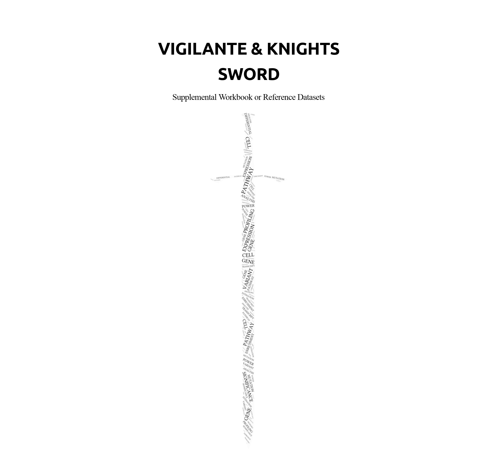

<!-- README.md is generated from README.Rmd. Please edit that file -->

```{r, include = FALSE}
knitr::opts_chunk$set(
  collapse = TRUE,
  comment = "#>",
  fig.path = "man/figures/README-",
  out.width = "100%"
)
```
# _vigilante.knights.sword_
##### Supplemental Workbook or Reference Datasets for "vigilante.knights" (the Main Package)

<!-- badges: start -->
<!-- badges: end -->

Due to the requirement of CRAN that general packages should not exceed 5MB, the **_s_**upplemental **_w_**orkbook **_o_**r **_r_**eference **_d_**atasets (**_sword_**) required by **_vigilante & knights_** have been extracted and put in this separate package **_vigilante.knights.sword_**. The goal of **_vigilante.knights.sword_** is to provide the indispensable components for the main package **_vigilante & knights_**. Please check [vigilante & knights](https://github.com/yilixu/vigilante) for more information. 

## Installation

The development version of **_vigilante.knights.sword_** can be installed following the in-house prompts of the main package **_vigilante & knights_**, or manually from GitHub with:

```{r installation_sword, eval = FALSE}
devtools::install_github("yilixu/vigilante.knights.sword", ref = "main")
```




#### References/Sources:
* [Keck Genomics Platform of University of Southern California](https://kgp.usc.edu)
* [The Cancer Genome Atlas (TCGA) Research Network](https://www.cancer.gov/tcga)
* Ksenia A., Zarko M., **Yili X.**, Yuxin J., Sharon C., Eric K., Michelle W., Nathan T., Kyle H. and Rick F. What Genes Can Tell: A Closer Look at Vestibular Schwannoma. _Otology & Neurotology_: April 2020 - Volume 41 - Issue 4 - p 522-529. doi: [10.1097/MAO.0000000000002580](https://doi.org/10.1097/mao.0000000000002580)
* Andrew Y., Premanand A., Wasiu A. et al. Ensembl 2020. Nucleic Acids Research, Volume 48, Issue D1, 08 January 2020, Pages D682–D688.
* Repana, D., Nulsen, J., Dressler, L. et al. The Network of Cancer Genes (NCG): a comprehensive catalogue of known and candidate cancer genes from cancer sequencing screens. Genome Biol 20, 1 (2019).
* Eisenberg E, Levanon EY. Human housekeeping genes, revisited. Trends Genet. 2013 Oct;29(10):569-74. Epub 2013 Jun 27. Erratum in: Trends Genet. 2014 Mar;30(3):119-20.
